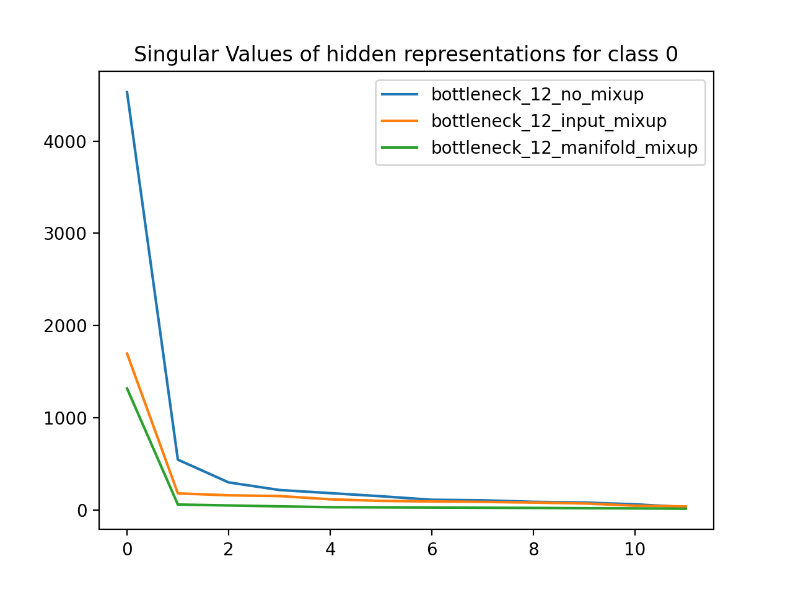

# Manifold Mixup ML Implementation
Tensorflow implementation of the following research paper:

"Manifold Mixup: Better Representations by Interpolating Hidden State" 

https://arxiv.org/pdf/1806.05236.pdf

**High level explanation**

Normally, you give a neural network data `x` (ie. an image) and train it to output a specific label `y` with high 
confidence. In manifold mixup, you also give the network data that’s on/near the decision boundary between different label
classes, and train it to output a label with low confidence because it should be uncertain about that data.

Manifold Mixup is a simple regularizer that encourages neural networks to:

* predict less confidently on interpolations of hidden representations
* limit the directions of variance for hidden representations of the same class, so hidden representations with the same
 class "clump" together.

## How does it work?

In training, during each forward pass of a mini batch, we choose a layer k among a set of eligible mixup layers.
During the forward pass for that mini batch, we perform "manifold mixup" at layer k:

1. We process the normal forward pass of the mini batch until we have the output of layer k - 1. We now have the layer 
(k-1)th hidden representation of all p points in our mini batch. Define the hidden representations as {x<sub>1</sub>,
 x<sub>2</sub>, x<sub>3</sub>, ... x<sub>p</sub>]
2. We draw a value &#955; from a beta distribution with shape parameter &#945;.
3. For each point p, we choose another point p' at random and perform mixup on the features and labels to get a new hidden 
representation x<sub>mp</sub> and label y<sub>mp</sub> for every point in the mini-batch
  * &#955; * x<sub>p</sub> + (1 - &#955;) * x<sub>p'</sub> = x<sub>mp</sub>
  * &#955; * y<sub>p</sub> + (1 - &#955;) * y<sub>p'</sub> = y<sub>mp</sub>
4. We then input these new mixup hidden representations into layer k and continue the forward pass. We define the loss
function/gradients on these new mixup hidden representations and their corresponding mixup labels.

## Manifold Mixup Results

With my Tensorflow implementation, I was able to reproduce some of the research paper's findings:

### Smoother decision boundary
I generated a synthetic spiral dataset (class 0 are orange points and class 1 are blue points).
Then, I trained 2 deep neural networks: one that uses manifold mixup and a baseline.
The below plots show the model's confidence for a given label
points in the input space. Yellow means it predicts class 0 with high probability, purple means it predicts class 1
with high probability, and green/blue means a low confidence for either label. The plots below show that there is a smoother
decision boundary and a bigger band of lower confidence predictions.

| baseline  |  manifold mixup |
:-----:|:-----:
 | 

### Larger margin between classes

Using the MNIST dataset (handwritten numbers), I trained neural networks with a 2D bottleneck layer (one that used manifold
mixup and a baseline). Then I plotted the hidden representation of the dataset at the 2D bottleneck layer. Points of the same color belong to the 
same class (ie. yellow refers to points with the label '3'). Looking at the difference between the baseline and the manifold
mixup models, we can see that manifold mixup makes the hidden representations much tighter with the real data occupying
smaller regions in the hidden space and with a bigger separating margin between the classes.


|         | Hidden Rep for #'s 0-4     |  Hidden Rep for #'s 0-9  |
:--------:|:-------------------------:|:-------------------------:
baseline ||
manifold mixup||

### Flatter representations ###

Using the MNIST dataset (handwritten numbers), I trained neural networks with a 12D bottleneck layer. One network 
was a baseline, another used Input Mixup, and the third used manifold mixup. I then grouped
the dataset by label class and found the matrix defining the 12D hidden representation for all data points of a particular class.
For each class, I plotted the singular values for the SVD of that hidden representation matrix. As expected, the singular
values for the manifold mixup model are much less than the respective singular values of the other models, which means
that manifold mixup leads to flatter representations.

|         |               |           |
:--------:|:-------------:|:----------:
|  |  | 
 |  | 
 |  | 
| || |


## Run the Demo

1. Install Python 3
2. `pip install virtualenv`
3. `make all`

## Add Manifold Mixup to your own deep neural network

I've created a class `ManifoldMixupModel` (in `models.py`) that implements manifold mixup for an arbitrary
deep neural network. Follow the below directions to add manifold mixup to your model:

1. Pass in your desired deep neural network as a list of tuples. Each tuple is a layer 
(subclass of tf.keras.layers.Layer) and a boolean that dictates whether that layer is eligible for mixup or not.
Example: (tf.keras.layers.Dense(1024), True)

2. Pass in `mixup_alpha`. It is the parameter used to initialize a beta distribution. We then draw &#955; 
(in the range [0, 1]) from this distribution, and use &#955; to do mixup in the current 
training step's mini batch. The paper recommends alpha values in this set: {0.1, 0.2, 0.4, 0.8, 1.0, 2.0, 4.0}.

The below example creates a deep neural network with manifold mixup using an alpha of 1.0. Only the 2nd to last and 3rd to
last layers are eligible for mixup.
```buildoutcfg
    manifold_mixup_model = ManifoldMixupModel(
        [
            (tf.keras.layers.Reshape(target_shape=(28 * 28,), input_shape=(28, 28)), False),
            (tf.keras.layers.Dense(1024), False),
            (tf.keras.layers.Dense(1024), False),
            (tf.keras.layers.Dense(1024), True),
            (tf.keras.layers.Dense(1024), True),
            (tf.keras.layers.Dense(10, activation='softmax'), False),
        ],
        mixup_alpha=1.0,
    )
```